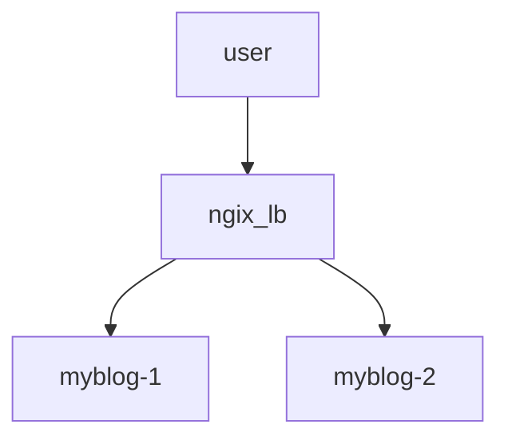

# DJ26 WEB APP

## STG
|BRANCH|URL|
|---|:---|
|dev|https://dj-twenty-six.web.app|
|stg|https://dj-twenty-six.fly.dev|
|prd|https://dj-twenty-six.github.io|

### LOCAL docker build
- https://hub.docker.com/_/httpd
```bash
$ docker build -t my-apache2 .
$ sudo docker images
REPOSITORY   TAG       IMAGE ID       CREATED         SIZE
my-apache2   latest    e133bdde4db8   2 minutes ago   173MB
```

### LOCAL docker run
``` bash
$ sudo docker run -dit --name my-webapp -p 8080:80 my-apache2
$ sudo docker ps
CONTAINER ID   IMAGE        COMMAND              CREATED         STATUS         PORTS                                   NAMES
c52058cd5124   my-apache2   "httpd-foreground"   6 seconds ago   Up 5 seconds   0.0.0.0:8080->80/tcp, :::8080->80/tcp   my-webapp
```

### LOCAL into docker
```bash
$ sudo docker exec -it my-webapp bash

root@c52058cd5124:/usr/local/apache2# ls -l
total 40
drwxr-xr-x 2 root root 4096 Oct 11 20:23 bin
drwxr-xr-x 2 root root 4096 Oct 11 20:23 build
drwxr-xr-x 2 root root 4096 Oct 11 20:23 cgi-bin
drwxr-xr-x 4 root root 4096 Oct 11 20:23 conf
drwxr-xr-x 3 root root 4096 Oct 11 20:23 error
drwxr-xr-x 1 root root 4096 Oct 18 21:12 htdocs
drwxr-xr-x 3 root root 4096 Oct 11 20:23 icons
drwxr-xr-x 2 root root 4096 Oct 11 20:23 include
drwxr-xr-x 1 root root 4096 Oct 18 21:13 logs
drwxr-xr-x 2 root root 4096 Oct 11 20:23 modules

root@c52058cd5124:/usr/local/apache2# cd htdocs/
root@c52058cd5124:/usr/local/apache2/htdocs# ls -l
total 96
-rw-r--r-- 1 root root    49 Oct 18 21:12 Dockerfile
-rw-r--r-- 1 root root 17128 Oct 19  2023 LICENSE.txt
-rw-r--r-- 1 root root    84 Oct 19  2023 LICENSE.txt:Zone.Identifier
-rw-r--r-- 1 root root   170 Oct 18 21:11 README.md
-rw-r--r-- 1 root root  1344 Oct 19  2023 README.txt
-rw-r--r-- 1 root root    84 Oct 19  2023 README.txt:Zone.Identifier
drwxr-xr-x 6 root root  4096 Oct 18 20:20 assets
-rw-r--r-- 1 root root 18398 Oct 19  2023 elements.html
-rw-r--r-- 1 root root    84 Oct 19  2023 elements.html:Zone.Identifier
-rw-r--r-- 1 root root  5045 Oct 19  2023 generic.html
-rw-r--r-- 1 root root    84 Oct 19  2023 generic.html:Zone.Identifier
drwxr-xr-x 2 root root  4096 Oct 18 20:20 images
-rw-r--r-- 1 root root  7195 Oct 18 21:04 index.html
-rw-r--r-- 1 root root    84 Oct 19  2023 index.html:Zone.Identifier
root@c52058cd5124:/usr/local/apache2/htdocs#
```

### how2pr
- https://oss.cashmallow.com/team/how2pr/


### Deploy DEV
- https://dj-twenty-six.web.app
```bash
$ firebase deploy

=== Deploying to 'dj-twenty-six'...

i  deploying hosting
i  hosting[dj-twenty-six]: beginning deploy...
i  hosting[dj-twenty-six]: found 364 files in /
✔  hosting[dj-twenty-six]: file upload complete
i  hosting[dj-twenty-six]: finalizing version...
✔  hosting[dj-twenty-six]: version finalized
i  hosting[dj-twenty-six]: releasing new version...
✔  hosting[dj-twenty-six]: release complete

✔  Deploy complete!

Project Console: https://console.firebase.google.com/project/dj-twenty-six/overview
Hosting URL: https://dj-twenty-six.web.app
```

### Deploy ST
- https://dj-twenty-six.fly.dev/
```bash
# https://fly.io/docs/hands-on/install-flyctl/
$ curl -L https://fly.io/install.sh | sh
$ tail -n 3 ~/.zshrc 
# fly.io
export FLYCTL_INSTALL="/home/dj26/.fly"
export PATH="$FLYCTL_INSTALL/bin:$PATH"

$ fly auth login

$ flyctl launch
Creating app in /home/dj26/code/dj-twenty-six.github.io
Scanning source code
Detected a Dockerfile app
? Choose an app name (leave blank to generate one): dj-twenty-six                                                                                                                                                                            
automatically selected personal organization: data.mario24@gmail.com
Some regions require a paid plan (bom, fra, maa).
See https://fly.io/plans to set up a plan.

? Choose a region for deployment: Tokyo, Japan (nrt)
App will use 'nrt' region as primary

Created app 'dj-twenty-six' in organization 'personal'
Admin URL: https://fly.io/apps/dj-twenty-six
Hostname: dj-twenty-six.fly.dev
? Would you like to set up a Postgresql database now? No
? Would you like to set up an Upstash Redis database now? No
? Create .dockerignore from 1 .gitignore files? No
Wrote config file fly.toml
? Would you like to deploy now? No
Validating /home/dj26/code/dj-twenty-six.github.io/fly.toml
Platform: machines
✓ Configuration is valid
Your app is ready! Deploy with `flyctl deploy`

$ tail -n 13  fly.toml
app = "dj-twenty-six"
primary_region = "nrt"

[build]
  dockerfile = "Dockerfile"

[http_service]
  internal_port = 80
  force_https = true
  auto_stop_machines = true
  auto_start_machines = true
  min_machines_running = 3
  processes = ["app"]

$ fly deploy
==> Verifying app config
Validating /home/dj26/code/dj-twenty-six.github.io/fly.toml
Platform: machines
✓ Configuration is valid
--> Verified app config
==> Building image
Remote builder fly-builder-solitary-frog-9277 ready
==> Building image with Docker
--> docker host: 20.10.12 linux x86_64
[+] Building 3.5s (7/7) FINISHED
 => [internal] load build definition from Dockerfile                                                                                                                                                                                    0.1s
 => => transferring dockerfile: 86B                                                                                                                                                                                                     0.1s 
 => [internal] load .dockerignore                                                                                                                                                                                                       0.1s 
 => => transferring context: 2B                                                                                                                                                                                                         0.1s 
 => [internal] load metadata for docker.io/library/httpd:2.4                                                                                                                                                                            0.9s
 => [internal] load build context                                                                                                                                                                                                       1.6s
 => => transferring context: 5.57MB                                                                                                                                                                                                     1.5s 
 => [1/2] FROM docker.io/library/httpd:2.4@sha256:ed6db4a8c394d075c9c59a3dbd61a3818cd302d9948057f1e19046e5bffec027                                                                                                                      2.2s 
 => => resolve docker.io/library/httpd:2.4@sha256:ed6db4a8c394d075c9c59a3dbd61a3818cd302d9948057f1e19046e5bffec027                                                                                                                      0.0s 
 => => sha256:a378f10b321842c3042cdeff4f6997f34f4cb21f2eff27704b7f6193ab7b5fea 29.15MB / 29.15MB                                                                                                                                        0.5s
 => => sha256:c20157372e943d84bb5a0624e80395697de1f41ecd54b3bcead2b03bb6b13fe8 176B / 176B                                                                                                                                              0.1s 
 => => sha256:073cbcfef6634b5131786873a7a92a3b3bda43672e5830126dfa94352649358d 4.20MB / 4.20MB                                                                                                                                          0.3s 
 => => sha256:5f75f8a17f406c926d42ef7e5e0803a23b150c46f77cda9c83bff10db3d68f2f 31.40MB / 31.40MB                                                                                                                                        0.6s 
 => => sha256:39fc6f0c5be2c5b90e4d0881260800bc921cb4c1db44c7a55e0b638914f0842f 301B / 301B                                                                                                                                              0.1s 
 => => sha256:ed6db4a8c394d075c9c59a3dbd61a3818cd302d9948057f1e19046e5bffec027 1.86kB / 1.86kB                                                                                                                                          0.0s 
 => => sha256:2f1ec45327a35711f293cf543c2e0efadfd44bc71e8081dcd76a558b99778005 1.37kB / 1.37kB                                                                                                                                          0.0s 
 => => sha256:75a48b16cd565cdaff0cfcbe3462c292e56108a22b9733c0a04a9dc1cbd7a774 9.09kB / 9.09kB                                                                                                                                          0.0s 
 => => extracting sha256:a378f10b321842c3042cdeff4f6997f34f4cb21f2eff27704b7f6193ab7b5fea                                                                                                                                               0.7s
 => => extracting sha256:c20157372e943d84bb5a0624e80395697de1f41ecd54b3bcead2b03bb6b13fe8                                                                                                                                               0.0s 
 => => extracting sha256:073cbcfef6634b5131786873a7a92a3b3bda43672e5830126dfa94352649358d                                                                                                                                               0.1s 
 => => extracting sha256:5f75f8a17f406c926d42ef7e5e0803a23b150c46f77cda9c83bff10db3d68f2f                                                                                                                                               0.6s 
 => => extracting sha256:39fc6f0c5be2c5b90e4d0881260800bc921cb4c1db44c7a55e0b638914f0842f                                                                                                                                               0.0s 
 => [2/2] COPY . /usr/local/apache2/htdocs/                                                                                                                                                                                             0.1s 
 => exporting to image                                                                                                                                                                                                                  0.1s 
 => => exporting layers                                                                                                                                                                                                                 0.1s 
 => => writing image sha256:71d9e30d334984aa8709593a5e784be5ec28dafd4f79767cfc56afa691a8e652                                                                                                                                            0.0s 
 => => naming to registry.fly.io/dj-twenty-six:deployment-01HDD3HGE3TH8J67MFQA7N0PY1                                                                                                                                                    0.0s 
--> Building image done
==> Pushing image to fly
The push refers to repository [registry.fly.io/dj-twenty-six]
6938b9c83b09: Pushed
b7094d4685d5: Pushed
87ca57c6f4e9: Pushed
1343ea427053: Pushed
8db3e477577e: Pushed
cb4596cc1454: Pushed
deployment-01HDD3HGE3TH8J67MFQA7N0PY1: digest: sha256:202cf5aa9a6d4ce015e028f796d2aebe1c9eebbd5007810d0f006e02ad054928 size: 1577
--> Pushing image done
image: registry.fly.io/dj-twenty-six:deployment-01HDD3HGE3TH8J67MFQA7N0PY1
image size: 174 MB

Watch your deployment at https://fly.io/apps/dj-twenty-six/monitoring

Provisioning ips for dj-twenty-six
  Dedicated ipv6: 2a09:8280:1::2d:8f27
  Shared ipv4: 66.241.124.124
  Add a dedicated ipv4 with: fly ips allocate-v4

This deployment will:
 * create 2 "app" machines

No machines in group app, launching a new machine
Creating a second machine to increase service availability
Finished launching new machines
-------
NOTE: The machines for [app] have services with 'auto_stop_machines = true' that will be stopped when idling

-------

Visit your newly deployed app at https://dj-twenty-six.fly.dev/
```

### Deploy PRD
- https://dj-twenty-six.github.io
- merge PR to main

### Load balancer - LB


```bash
# https://docs.docker.com/engine/reference/commandline/run/#options
$ docker build -t myblog:1.3.0 .
$ docker run -dit --name myblog-1 -p 8051:80 myblog:1.3.0
$ docker run -dit --name myblog-2 -p 8052:80 myblog:1.3.0

$ docker build -t nginx_lb:1.3.0 docker_file/lb_nginx
$ docker images
REPOSITORY          TAG       IMAGE ID       CREATED          SIZE
myblog              1.3.0     b9a01b885bee   39 seconds ago   174MB
nginx_lb            1.3.0     a325da935d4f   3 minutes ago    187MB

$ docker run --name ngix_lb -d -p 9052:80 --link myblog-1 --link myblog-2 nginx_lb:1.3.0

$ docker ps
CONTAINER ID   IMAGE            COMMAND                  CREATED              STATUS              PORTS                                   NAMES
f2d0fcd245b3   nginx_lb:1.3.0   "/docker-entrypoint.…"   4 seconds ago        Up 4 seconds        0.0.0.0:9052->80/tcp, :::9052->80/tcp   ngix_lb
c976e579245b   myblog:1.3.0     "httpd-foreground"       About a minute ago   Up About a minute   0.0.0.0:8052->80/tcp, :::8052->80/tcp   myblog-2
31d91debe836   myblog:1.3.0     "httpd-foreground"       About a minute ago   Up About a minute   0.0.0.0:8051->80/tcp, :::8051->80/tcp   myblog-1
```